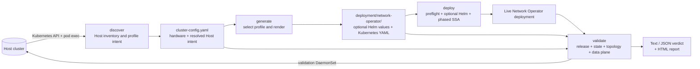
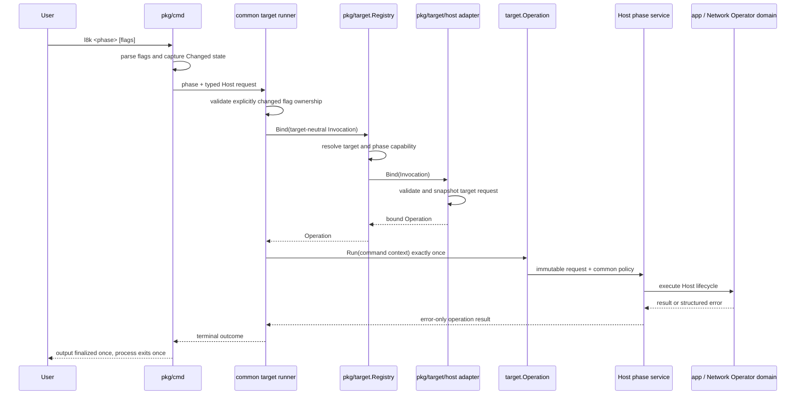
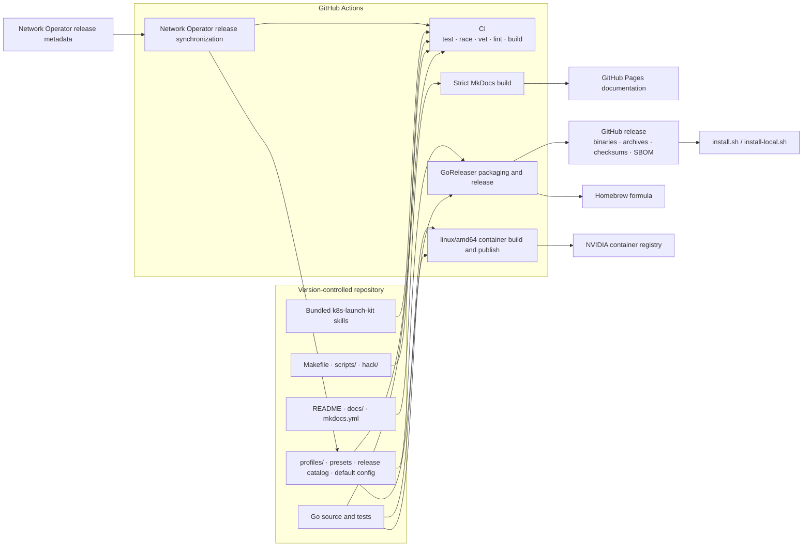

<!--
SPDX-FileCopyrightText: Copyright 2026 NVIDIA CORPORATION & AFFILIATES
SPDX-License-Identifier: Apache-2.0
-->

# Launch Kit architecture

This page is the canonical architectural map of Kubernetes Launch Kit. It
documents the repository boundaries, lifecycle data flow, external systems,
and the target extension seam. Pull requests that change any of those areas
must update this page in the same change.

## Complete component map

```mermaid
flowchart TB
    actor["Operator / automation / AI agent"]

    subgraph process["l8k process"]
        main["main.go"]

        subgraph cli["CLI and process boundary — pkg/cmd"]
            cobra["Cobra command tree"]
            lifecycle["discover · generate · deploy · validate · root pipeline"]
            auxiliary["clean · sosreport · preset · schema · version"]
            flags["Flag groups, target ownership, explicit-value capture"]
            runner["Common target runner\nbind once · Run(ctx) once · exit once"]
        end

        subgraph targetcore["Target-neutral runtime — pkg/target"]
            registry["Registry + capability descriptors"]
            invocation["Invocation\nphase · output policy · dry-run · timeout"]
            operation["Operation.Run(context)"]
        end

        subgraph targets["Target implementations"]
            subgraph host["HostTarget — pkg/target/host"]
                hostadapters["Typed immutable phase adapters"]
                launchersvc["Discover / generate / pipeline runner"]
                deploysvc["Standalone deploy service"]
                validatesvc["Standalone validate + report service"]
                hostpaths["Host config, kubeconfig, preset, artifact resolution"]
            end
            dpf["DPF target extension point\nrecognized; phases unavailable"]
        end

        subgraph application["Host application orchestration"]
            launcher["pkg/app Launcher\nworkflow state · JSON result · context"]
            opts["pkg/options\nHost CLI option model"]
            config["pkg/config\ncluster-config schema + defaults"]
            resolve["pkg/resolve\nhardware defaults + resolved validation"]
            assets["pkg/assets\nconfig-dir and installed assets"]
            profiles["pkg/profiles\nprofile metadata and matching"]
            presets["pkg/presets + pkg/presetmatch\ncertified topology catalog and drift"]
        end

        subgraph netop["Network Operator domain — pkg/networkoperatorplugin"]
            plugin["plugin.Plugin implementation"]
            cfgoverrides["CLI-to-config override registry\nflag · config paths · explicit setter"]
            discovery["Discovery\nbootstrap daemon · inventory · grouping · node labels"]
            rendering["Generation\nprofile selection · templates · render plan"]
            releases["Embedded release catalog"]
            spectrumx["Spectrum-X addressing and config"]
            deploy["Deployment state machine\nHelm · preflight · phased apply"]
            validation["Static validation\nrelease · components · manifests · drift"]
            connectivity["Connectivity validation\nICMP · rping · ib_write_bw · GPUDirect"]
            crstate["Per-Kind reconciliation registry"]
            daemon["pkg/nicconfigdaemon\nembedded discovery workload"]
        end

        subgraph platform["Shared runtime services"]
            kubeclient["pkg/kubeclient\ncontroller-runtime client · REST config · pod exec"]
            ui["pkg/ui\ntext · quiet · JSON · progress"]
            errors["pkg/errors\nstructured errors · reported output · exit status"]
            logging["pkg/log"]
            firmware["pkg/fwresolver"]
        end
    end

    subgraph artifacts["Host artifacts and embedded inputs"]
        clusterconfig["cluster-config.yaml"]
        deploymentfiles["deployment/network-operator/\noptional values.yaml + ordered manifests"]
        report["k8s-launch-kit-validation-report.html"]
        profiledata["profiles/ · presets/ · release catalog · default config"]
    end

    subgraph cluster["Kubernetes host cluster"]
        api["Kubernetes API server"]
        helm["Network Operator Helm release"]
        operators["Network Operator and managed controllers"]
        crs["NCP · NNP · NIC config · SR-IOV · secondary-network CRs"]
        workloads["Discovery and validation DaemonSets"]
        hardware["Worker nodes · NICs · GPUs · RDMA devices"]
    end

    external["External image, firmware, and preset sources"]
    dpfoperator["Future DPF driver / DPF Operator / DPU plane"]

    actor --> main --> cobra
    cobra --> lifecycle
    cobra --> auxiliary
    lifecycle --> flags --> runner
    runner --> registry
    runner --> invocation
    registry --> hostadapters
    registry -. capability rejection .-> dpf
    hostadapters --> operation
    invocation --> operation
    operation --> launchersvc
    operation --> deploysvc
    operation --> validatesvc

    launchersvc --> launcher
    launchersvc --> hostpaths
    deploysvc --> hostpaths
    validatesvc --> hostpaths
    launcher --> opts
    launcher --> config
    launcher --> resolve
    launcher --> assets
    launcher --> profiles
    launcher --> presets
    launcher --> plugin

    flags --> cfgoverrides
    hostpaths --> cfgoverrides
    plugin --> cfgoverrides
    cfgoverrides --> config
    plugin --> discovery
    plugin --> rendering
    plugin --> deploy
    discovery --> daemon
    discovery --> presets
    discovery --> kubeclient
    rendering --> releases
    rendering --> spectrumx
    rendering --> profiles
    deploy --> releases
    deploy --> crstate
    validation --> releases
    validation --> crstate
    validation --> presets
    validatesvc --> validation
    validatesvc --> connectivity
    connectivity --> kubeclient
    deploysvc --> deploy

    hostpaths --> clusterconfig
    discovery --> clusterconfig
    clusterconfig --> rendering
    profiledata --> assets
    profiledata --> profiles
    profiledata --> presets
    profiledata --> releases
    rendering --> deploymentfiles
    deploymentfiles --> deploysvc
    deploymentfiles --> validatesvc
    validatesvc --> report

    kubeclient --> api
    deploy --> helm
    helm --> operators
    api --> operators
    api --> crs
    api --> workloads
    discovery --> workloads
    connectivity --> workloads
    workloads --> hardware
    crstate --> crs
    firmware --> external
    releases --> external
    presets --> external

    launcher --> ui
    deploysvc --> ui
    validatesvc --> ui
    launcher --> errors
    deploysvc --> errors
    validatesvc --> errors
    runner --> errors
    process --> logging

    dpf -. future typed adapter .-> dpfoperator
```

The diagram distinguishes three boundaries that should remain stable:

1. `pkg/cmd` parses Cobra state and owns process termination.
2. `pkg/target` carries only policy whose meaning is identical for every
   target.
3. `pkg/target/host` owns Host-specific requests, configuration lookup, and
   lifecycle services. Network Operator remains a Host-internal plugin rather
   than a target abstraction.

## Lifecycle and artifact flow

The legacy root command composes `discover → generate → optional deploy` in one
Host operation. Validation deliberately remains a separate phase.

`networkOperator.skipHelmChart` is a Host-specific lifecycle switch routed by
`--skip-network-operator-helm`. It removes the `values.yaml` artifact and
bypasses the Helm install/version/values/uninstall edges, while preserving the
Network Operator manifest, component-version, stray-resource, data-plane, and
custom-resource cleanup paths. Cleanup reads the persistent config setting to
avoid removing a release owned by another system.

Config-backed Host flags are registered once in the Network Operator plugin's
CLI-to-config override registry. Each entry owns the CLI flag name, the YAML
path or paths it controls, explicit-value detection, and the setter. Discover,
generate, standalone deploy, and standalone validate all call the same
`ApplyCLIConfigOverrides` boundary after loading configuration. `l8k schema`
publishes the same registry metadata as `flags[].configPaths`, so routing and
automation do not maintain a second flag-to-config table.

## Target binding and execution

Selecting `dpf` stops at registry capability resolution in the current build.
It does not construct a Kubernetes client or enter any Host lifecycle service.

## Deployment and validation internals

```mermaid
flowchart TB
    subgraph deployflow["Host deploy"]
        d0["Resolve config, manifests, kubeconfig"]
        d1["Phase 0: optional Helm install / upgrade"]
        d05["Phase 0.5: drift and stray-resource preflight"]
        d2["Phase 1: NicClusterPolicy + readiness"]
        d3["Phase 2: NicNodePolicies + per-policy readiness"]
        d4["Phase 3: batch remaining manifests"]
        d5["Phase 4: verify terminal reconciliation state"]
        d0 --> d1 --> d05 --> d2 --> d3 --> d4 --> d5
    end

    subgraph validateflow["Host validate"]
        v0["Resolve config, manifests, kubeconfig, preset catalog"]
        v1["Optional Helm release/values, component versions, stray CRs"]
        v2["crstate manifest classification"]
        v3{"Static state terminal?"}
        v4["Connectivity matrix and optional GPUDirect DMA-BUF"]
        v5["Aggregate verdict and warnings"]
        v6["Write synchronous HTML report"]
        v0 --> v1 --> v2 --> v3
        v3 -->|ready| v4 --> v5
        v3 -->|missing / error / in-progress| v5
        v5 --> v6
    end
```

## Package ownership

| Boundary | Owns | Must not own |
| --- | --- | --- |
| `pkg/cmd` | Cobra declarations, target flag ownership, request construction, final process exit | Host cluster orchestration or DPF configuration |
| `pkg/target` | Names, phases, capabilities, common invocation policy, registry, operation contract | Cobra, Host options, DPF options, Kubernetes clients |
| `pkg/target/host` | Typed Host requests, explicit-value semantics, Host path/config resolution, phase services | DPF implementation or cross-target composition |
| `pkg/app` | Discover/generate/root workflow state and Network Operator plugin coordination | CLI parsing or process exit |
| `pkg/networkoperatorplugin` | Host CLI-to-config override registry, discovery, rendering, deployment state machine, validation primitives | Target selection |
| `pkg/config`, `pkg/options` | Existing Host configuration and option models | A universal union of Host and DPF configuration |
| `pkg/ui`, `pkg/errors`, `pkg/log` | Presentation, structured failures, and logging | Domain decisions |

## Build, release, and documentation supply chain

The packaged binary embeds its default configuration, profile templates,
topology presets, release catalog, and discovery workload. A release or sync
change therefore belongs in this architecture even when it does not modify a
runtime Go package.

## Updating this architecture

Update this page whenever a pull request changes any of the following:

- lifecycle commands, target names, phase capabilities, or flag ownership;
- package ownership or an import direction shown above;
- `cluster-config.yaml`, generated artifact, or report layout;
- discovery, render, deployment, or validation ordering;
- Kubernetes, Helm, registry, firmware, or other external boundaries;
- build, release, packaging, documentation, or embedded-input flows;
- a new target implementation or cross-target environment composer.

The PR author should check the component map, lifecycle flow, binding sequence,
deployment/validation flow, package ownership, and delivery supply chain. If a
diagram node is renamed, moved, added, or removed, update its adjacent edges in
the same commit. Keep implementation plans separate from this page: this
document describes the current architecture, while files such as the
[DPF integration roadmap](dpf-integration-plan.md) describe intended changes.
